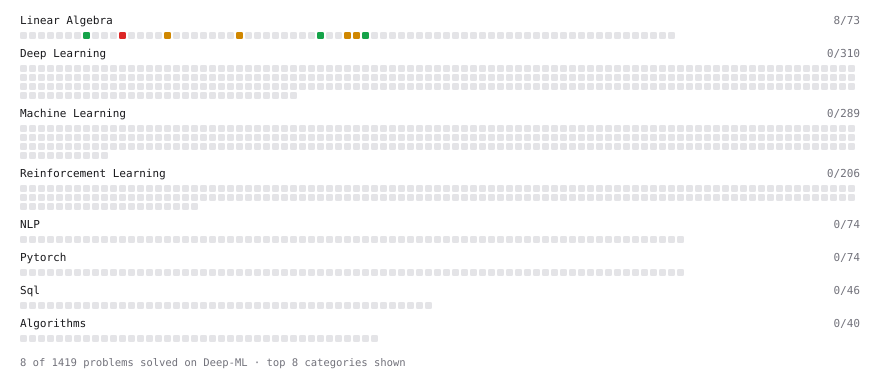

# Deep-ML

My machine learning practice from [Deep-ML](https://www.deep-ml.com). Every solution here was written by hand.

**14** solved · 10 problems · 0 labs · 4 math

[**Browse the interactive portfolio**](https://JacksonCobble.github.io/deep-ml/) to replay this filling in over time.

## Problems

| | Difficulty | Solved | |
| --- | --- | --- | --- |
| [Calculate 2x2 Matrix Inverse](https://www.deep-ml.com/problems/8) | easy | 2026-09-19 | [solution](problems/0008-calculate-2x2-matrix-inverse) |
| [Check Linear Independence of Vectors](https://www.deep-ml.com/problems/331) | easy | 2026-09-19 | [solution](problems/0331-check-linear-independence-of-vectors) |
| [Matrix Determinant & Trace](https://www.deep-ml.com/problems/195) | easy | 2026-09-19 | [solution](problems/0195-matrix-determinant-trace) |
| [Compute the Null Space (Kernel) of a Matrix](https://www.deep-ml.com/problems/330) | medium | 2026-09-20 | [solution](problems/0330-compute-the-null-space-kernel-of-a-matrix) |
| [Find the column space of a matrix](https://www.deep-ml.com/problems/68) | medium | 2026-09-20 | [solution](problems/0068-find-the-column-space-of-a-matrix) |
| [Gauss-Seidel Method for Solving Linear Systems](https://www.deep-ml.com/problems/57) | medium | 2026-09-23 | [solution](problems/0057-gauss-seidel-method-for-solving-linear-systems) |
| [Gaussian Elimination for Solving Linear Systems](https://www.deep-ml.com/problems/58) | medium | 2026-09-23 | [solution](problems/0058-gaussian-elimination-for-solving-linear-systems) |
| [Implement Reduced Row Echelon Form (RREF) Function](https://www.deep-ml.com/problems/48) | medium | 2026-09-20 | [solution](problems/0048-implement-reduced-row-echelon-form-rref-function) |
| [Matrix Rank](https://www.deep-ml.com/problems/329) | medium | 2026-09-19 | [solution](problems/0329-matrix-rank) |
| [Determinant of a 4x4 Matrix using Laplace's Expansion (hard)](https://www.deep-ml.com/problems/13) | hard | 2026-09-19 | [solution](problems/0013-determinant-of-a-4x4-matrix-using-laplace-s-expansion-hard) |

## Math

| | Difficulty | Solved | |
| --- | --- | --- | --- |
| [Derivatives and Gradients](https://www.deep-ml.com/math-problems/1) | easy | 2026-09-20 | [solution](math/0001-derivatives-and-gradients) |
| [Inverse and Rank](https://www.deep-ml.com/math-problems/12) | medium | 2026-09-19 | [solution](math/0012-inverse-and-rank) |
| [Solving Linear Systems](https://www.deep-ml.com/math-problems/13) | medium | 2026-09-20 | [solution](math/0013-solving-linear-systems) |
| [The Four Fundamental Subspaces](https://www.deep-ml.com/math-problems/46) | medium | 2026-09-19 | [solution](math/0046-the-four-fundamental-subspaces) |

---

_This file is regenerated by Deep-ML on every push._
