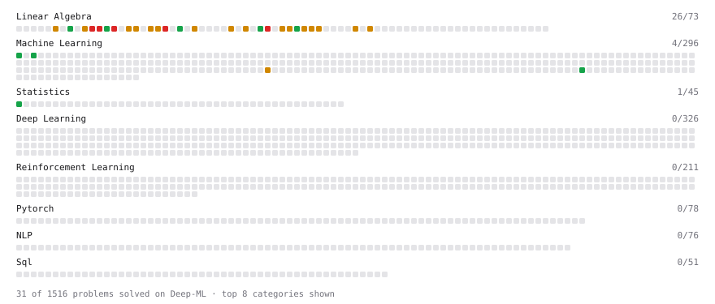

# Deep-ML

My machine learning practice from [Deep-ML](https://www.deep-ml.com). Every solution here was written by hand.

**43** solved · 27 problems · 1 labs · 15 math

[**Browse the interactive portfolio**](https://JacksonCobble.github.io/deep-ml/) to replay this filling in over time.

## Problems

| | Difficulty | Solved | |
| --- | --- | --- | --- |
| [Calculate 2x2 Matrix Inverse](https://www.deep-ml.com/problems/8) | easy | 2026-09-19 | [solution](problems/0008-calculate-2x2-matrix-inverse) |
| [Calculate Covariance Matrix](https://www.deep-ml.com/problems/10) | easy | 2026-10-01 | [solution](problems/0010-calculate-covariance-matrix) |
| [Check Linear Independence of Vectors](https://www.deep-ml.com/problems/331) | easy | 2026-09-19 | [solution](problems/0331-check-linear-independence-of-vectors) |
| [Implement Orthogonal Projection of a Vector onto a Line](https://www.deep-ml.com/problems/66) | easy | 2026-09-25 | [solution](problems/0066-implement-orthogonal-projection-of-a-vector-onto-a-line) |
| [Linear Regression Using Normal Equation](https://www.deep-ml.com/problems/14) | easy | 2026-09-25 | [solution](problems/0014-linear-regression-using-normal-equation) |
| [Matrix Determinant & Trace](https://www.deep-ml.com/problems/195) | easy | 2026-09-19 | [solution](problems/0195-matrix-determinant-trace) |
| [Transformation Matrix from Basis B to C](https://www.deep-ml.com/problems/27) | easy | 2026-09-25 | [solution](problems/0027-transformation-matrix-from-basis-b-to-c) |
| [Analyze Singular Value Spectrum to Determine Intrinsic Rank](https://www.deep-ml.com/problems/876) | medium | 2026-10-01 | [solution](problems/0876-analyze-singular-value-spectrum-to-determine-intrinsic-rank) |
| [Calculate Eigenvalues of a Matrix](https://www.deep-ml.com/problems/6) | medium | 2026-09-30 | [solution](problems/0006-calculate-eigenvalues-of-a-matrix) |
| [Check if Matrix is Positive Definite](https://www.deep-ml.com/problems/332) | medium | 2026-09-29 | [solution](problems/0332-check-if-matrix-is-positive-definite) |
| [Cholesky Decomposition](https://www.deep-ml.com/problems/334) | medium | 2026-09-30 | [solution](problems/0334-cholesky-decomposition) |
| [Compute Orthonormal Basis for 2D Vectors](https://www.deep-ml.com/problems/117) | medium | 2026-09-25 | [solution](problems/0117-compute-orthonormal-basis-for-2d-vectors) |
| [Compute the Null Space (Kernel) of a Matrix](https://www.deep-ml.com/problems/330) | medium | 2026-09-20 | [solution](problems/0330-compute-the-null-space-kernel-of-a-matrix) |
| [Find the column space of a matrix](https://www.deep-ml.com/problems/68) | medium | 2026-09-20 | [solution](problems/0068-find-the-column-space-of-a-matrix) |
| [Gauss-Seidel Method for Solving Linear Systems](https://www.deep-ml.com/problems/57) | medium | 2026-09-23 | [solution](problems/0057-gauss-seidel-method-for-solving-linear-systems) |
| [Gaussian Elimination for Solving Linear Systems](https://www.deep-ml.com/problems/58) | medium | 2026-09-23 | [solution](problems/0058-gaussian-elimination-for-solving-linear-systems) |
| [Implement Reduced Row Echelon Form (RREF) Function](https://www.deep-ml.com/problems/48) | medium | 2026-09-20 | [solution](problems/0048-implement-reduced-row-echelon-form-rref-function) |
| [LU Decomposition of a Square Matrix](https://www.deep-ml.com/problems/333) | medium | 2026-09-29 | [solution](problems/0333-lu-decomposition-of-a-square-matrix) |
| [Matrix Rank](https://www.deep-ml.com/problems/329) | medium | 2026-09-19 | [solution](problems/0329-matrix-rank) |
| [Solve Linear Equations using Jacobi Method](https://www.deep-ml.com/problems/11) | medium | 2026-09-23 | [solution](problems/0011-solve-linear-equations-using-jacobi-method) |
| [Solve System of Linear Equations Using Cramer's Rule](https://www.deep-ml.com/problems/119) | medium | 2026-09-23 | [solution](problems/0119-solve-system-of-linear-equations-using-cramer-s-rule) |
| [Truncated SVD Rank-r Approximation of Weight Updates](https://www.deep-ml.com/problems/872) | medium | 2026-10-01 | [solution](problems/0872-truncated-svd-rank-r-approximation-of-weight-updates) |
| [Determinant of a 4x4 Matrix using Laplace's Expansion (hard)](https://www.deep-ml.com/problems/13) | hard | 2026-09-19 | [solution](problems/0013-determinant-of-a-4x4-matrix-using-laplace-s-expansion-hard) |
| [Implement the Conjugate Gradient Method for Solving Linear Systems](https://www.deep-ml.com/problems/63) | hard | 2026-09-24 | [solution](problems/0063-implement-the-conjugate-gradient-method-for-solving-linear-systems) |
| [QR Decomposition](https://www.deep-ml.com/problems/201) | hard | 2026-09-29 | [solution](problems/0201-qr-decomposition) |
| [Singular Value Decomposition (SVD) of 2x2 Matrix](https://www.deep-ml.com/problems/12) | hard | 2026-10-01 | [solution](problems/0012-singular-value-decomposition-svd-of-2x2-matrix) |
| [SVD of a 2x2 Matrix](https://www.deep-ml.com/problems/28) | hard | 2026-10-01 | [solution](problems/0028-svd-of-a-2x2-matrix) |

## Labs

| | Difficulty | Solved | |
| --- | --- | --- | --- |
| [Train a Linear Regression Model](https://www.deep-ml.com/labs/18) | easy | 2026-09-25 | [solution](labs/0018-train-a-linear-regression-model) |

## Math

| | Difficulty | Solved | |
| --- | --- | --- | --- |
| [Derivatives and Gradients](https://www.deep-ml.com/math-problems/1) | easy | 2026-09-20 | [solution](math/0001-derivatives-and-gradients) |
| [Descriptive Statistics](https://www.deep-ml.com/math-problems/18) | easy | 2026-10-01 | [solution](math/0018-descriptive-statistics) |
| [Gradient Descent Updates](https://www.deep-ml.com/math-problems/5) | easy | 2026-09-25 | [solution](math/0005-gradient-descent-updates) |
| [ML Workflow Basics](https://www.deep-ml.com/math-problems/30) | easy | 2026-09-25 | [solution](math/0030-ml-workflow-basics) |
| [Covariance and Correlation](https://www.deep-ml.com/math-problems/17) | medium | 2026-10-01 | [solution](math/0017-covariance-and-correlation) |
| [Gram–Schmidt and Orthonormal Bases](https://www.deep-ml.com/math-problems/47) | medium | 2026-09-25 | [solution](math/0047-gram-schmidt-and-orthonormal-bases) |
| [Inverse and Rank](https://www.deep-ml.com/math-problems/12) | medium | 2026-09-19 | [solution](math/0012-inverse-and-rank) |
| [Least Squares and the Normal Equations](https://www.deep-ml.com/math-problems/34) | medium | 2026-09-24 | [solution](math/0034-least-squares-and-the-normal-equations) |
| [Orthogonality and Projections](https://www.deep-ml.com/math-problems/14) | medium | 2026-09-24 | [solution](math/0014-orthogonality-and-projections) |
| [Positive Definite Matrices and Quadratic Forms](https://www.deep-ml.com/math-problems/50) | medium | 2026-09-30 | [solution](math/0050-positive-definite-matrices-and-quadratic-forms) |
| [Pseudoinverse and Minimum-Norm Least Squares](https://www.deep-ml.com/math-problems/48) | medium | 2026-09-25 | [solution](math/0048-pseudoinverse-and-minimum-norm-least-squares) |
| [Solving Linear Systems](https://www.deep-ml.com/math-problems/13) | medium | 2026-09-20 | [solution](math/0013-solving-linear-systems) |
| [The Four Fundamental Subspaces](https://www.deep-ml.com/math-problems/46) | medium | 2026-09-19 | [solution](math/0046-the-four-fundamental-subspaces) |
| [Eigendecomposition and SVD](https://www.deep-ml.com/math-problems/16) | hard | 2026-09-29 | [solution](math/0016-eigendecomposition-and-svd) |
| [Matrix Decompositions: LU and QR](https://www.deep-ml.com/math-problems/15) | hard | 2026-09-28 | [solution](math/0015-matrix-decompositions-lu-and-qr) |

---

_This file is regenerated by Deep-ML on every push._
